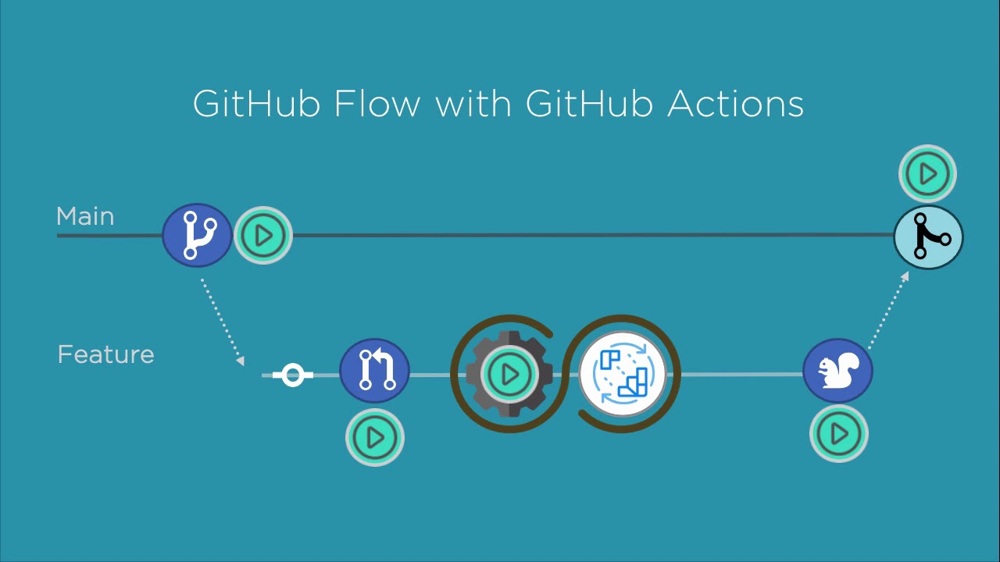
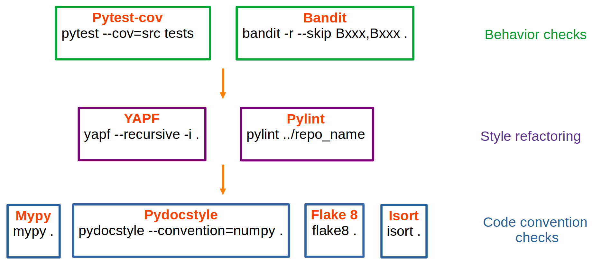

# Personal workflow template

**Disclaimer**: Even if it is a personal project, everybody can use it freely and modify it for their own needs.

This repository is a template for using some GitHub worflows:

- ✅ `pytest-cov` to check unit tests and get coverage (including an optional minimum coverage to pass)
- 🎨 `pycodestyle` and `flake` to check Python scripts style (PEP8)
- 🎨 `isort` to check the import order of Python scripts
- 🎨 `pylint` to have an overall grade of the style (incuding an optional minimum grade to pass)
- 📝 `pydocstyle` to check Python docstrings style (Numpy convention)
- 🏷️ `mypy` to check typing
- 🔒 `bandit` for security
- 🔄 Cache is preserved between runs (usefull for heavy requirements)
- ⌚ Last commit and release date
- 🧑‍🤝‍🧑 Github stats
- Some other badges are provided (such as release ⏫, licenses 📑 and python version 🔖).

All worflows create a badge available, for instace, in README.

This repository provides also a pre-commit configuration to check end-of-file, trailing whitespace, flake8, pydocstyle (numpy) and isort.

## HowTo

All feature of this template is easy to adapt on your project by changing names or versions on the `.github/workflows/` directory and on the badge paths on your markdown/rst files. All the worflows are independent and can be used individually.

First you need to create a [gist](https://gist.github.com/) The id of the gist is required for pylint and test/coverage badges. Then, you must add a secret in your repository (*Settings > Secrets > New repository secret*) that is a personal token with gist scope with name GIST_SECRET (details [here](https://github.com/Schneegans/dynamic-badges-action)).

## Notes

By default, there is no maximum unit test coverage but you can set the minimum coverage you want in `utils/github_actions/pytest_manager.py`. There is also a minimum grade for pylint that is 7.0/10 and can be set in `utils/github_actions/pylint_manager.py`. Details of pylint options are in `.pylintrc` and can also be changed at will. Pycodestyle, Flake, Pydocstyle, MyPy, Bandit should raise no warnings/errors to pass (but not YAPF).

## Contributing

Even if it is a personal template, feel free to contribute via issues or pull requests 🤗
